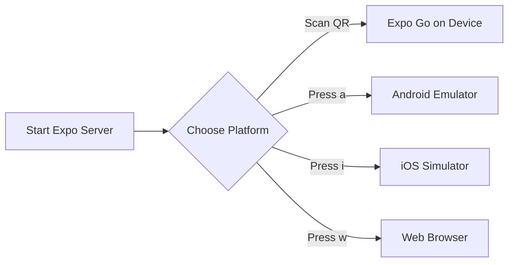

# 💊 Where Is My Medicine (WIMM)

[](https://opensource.org/licenses/MIT)
[](https://expo.dev/)
[](https://reactnative.dev/)
[](https://firebase.google.com/)
[](https://vitejs.dev/)

> Real-time geo-localized prescription coordination and stock-matching ecosystem connecting patients, pharmacies, and administrators.

Where Is My Medicine (WIMM) is a modern, high-performance monorepo platform designed to bridge the gap between patients seeking specific medications and local pharmacies. Built on top of React Native (Expo) for mobile apps, React (Vite) for the administrative console, and a serverless Firebase backend, the ecosystem allows users to search for medications nearby or upload digital prescriptions. Patients can select and highlight regions on their prescriptions, which are automatically distributed to pharmacies within a configurable geographic radius using Geohash-based spatial queries. Local pharmacies can quickly review requests and interactively highlight which prescribed items they have in stock—syncing status and coordinates in real-time.

---

## 📷 Screenshots / Preview

| Customer Mobile App | Pharmacy Mobile App | Admin Dashboard |
| :---: | :---: | :---: |
|  |  |  |

> [!NOTE]  
> **Placeholder Assets:** To display your actual UI screenshots, place your PNG or GIF files into a directory named `where-is-my-medicine/assets/screenshots/` and update the markdown links above with the corresponding file names.

---

## ✨ Features

### 👤 Patient Mobile App (Customer)
*   **Location-Aware Medicine Search:** Query nearby active pharmacies carrying specific drugs based on GPS coordinates and Geohashes.
*   **Prescription Capture & Upload:** Capture physical prescriptions using the camera (`expo-camera`) or import them from the device photo library (`expo-image-picker`).
*   **Interactive Bounding-Box Selection:** Draw precise bounding boxes (using `react-native-svg` and `PanResponder`) on prescription images to specify which items are required, or toggle **"Need All"**.
*   **Real-Time Status Tracking:** Track pharmacy responses in real time with color-coded status badges (`pending`, `accepted`, `expired`, `cancelled`).

### 🏪 Pharmacy Mobile App
*   **Geo-Targeted Request Feed:** View pending requests in a list where the customer is within the pharmacy's geographic service radius.
*   **Interactive Response Canvas:** View patient prescriptions and draw green bounding boxes on medicines that are currently in stock before accepting.
*   **Inventory Synchronization:** Update the list of carried medicines instantly to allow matching against direct search queries.
*   **Instant Syncing:** Save highlights and sync them in real time to the patient's request detail screen.

### 🛡️ Administrative Web Console
*   **Centralized Analytics Dashboard:** Monitor statistics on onboarded pharmacies, active pharmacies, pending requests, and fulfilled requests.
*   **Pharmacy Lifecycle Management:** Onboard, update, activate/deactivate, and manage subscriptions (`free`, `basic`, `premium`) for pharmacies.
*   **Geocoding Integration:** Input pharmacy coordinates (latitude/longitude) to automatically generate Geohashes.
*   **System-Wide Configurator:** Configure the global search radius (`maxRequestRadiusKm`) and request Time-To-Live (`requestTTLMinutes`).

### 🛠️ Developer & Architecture Highlights
*   **Monorepo Workspaces:** Clean separation of concerns with shared npm packages (`@wimm/shared` and `@wimm/firebase-config`).
*   **FCM Push Notifications:** Node.js Cloud Functions automatically trigger Firebase Cloud Messaging (FCM) payloads for requests and status updates.
*   **Strict Security Rules:** Granular role-based Firestore and Storage security rules protecting patient confidentiality and pharmacy records.

---

## 💻 Tech Stack

| Category | Technology | Purpose |
| :--- | :--- | :--- |
| **Mobile Framework** | **React Native (Expo SDK 54)** | Cross-platform mobile development (iOS/Android) |
| **Frontend (Web)** | **React 19 & Vite 5** | High-performance admin management web application |
| **Backend & Serverless** | **Firebase Cloud Functions (v2)** | Asynchronous push notifications, geolocation lookups, role promotion |
| **Database** | **Cloud Firestore** | Real-time NoSQL database with spatial indexing (Geohashes) |
| **Cloud Storage** | **Firebase Storage** | Secure image hosting for uploaded medical prescriptions |
| **Authentication** | **Firebase Authentication** | Secure email/password login with custom admin role claims |
| **State Management** | **Zustand** | Light, decoupling client-side stores for customers and pharmacies |
| **Utilities** | **geofire-common** | Bounding box spatial calculations and Haversine formula distance measurements |

---

## 📂 Folder Structure

```
where-is-my-medicine/
├── apps/
│   ├── admin/                # Vite Admin Panel (React 19 Web App)
│   │   ├── src/
│   │   │   ├── App.jsx       # Auth logic, Dashboard, CRUD Pharmacies, Settings
│   │   │   ├── firebase.js   # Admin-specific Firebase SDK initialization
│   │   │   └── index.css     # CSS variable-based design system
│   │   ├── index.html
│   │   └── package.json
│   ├── customer/             # Customer Expo App (React Native)
│   │   ├── App.js            # Customer routing, NavigationContainer & auth sync
│   │   └── src/
│   │       ├── screens/      # Login, Register, Home, PrescriptionUpload, RequestDetail, Profile
│   │       └── store/        # Zustand state store (useStore.js)
│   └── pharmacy/             # Pharmacy Expo App (React Native)
│       ├── App.js            # Pharmacy routing & profile initialization
│       └── src/
│           ├── screens/      # Login, IncomingRequests, RespondRequest, Medicines
│           └── store/        # Zustand state store (usePharmacyStore.js)
├── packages/
│   ├── firebase-config/      # Shared Firebase wrapper package
│   │   ├── src/
│   │   │   ├── auth.ts       # Register, signIn, signOut, and role sync helpers
│   │   │   ├── firebase.ts   # Lazy singletons, AsyncStorage native vs web check
│   │   │   ├── firestore.ts  # Database operations (CRUD, snapping real-time updates)
│   │   │   └── storage.ts    # Prescription image uploads, URLs and removals
│   │   └── package.json
│   └── shared/               # Shared Utilities & Types package
│       ├── src/
│       │   ├── geo.ts        # Geohash calculations, distance sorting, radius filtering
│       │   ├── types.ts      # Shared TypeScript models (UserProfile, Pharmacy, Request)
│       │   └── index.ts      # Centralized exports
│       └── package.json
├── firebase/                 # Firebase configuration, security rules & cloud code
│   ├── functions/            # Cloud Functions in Node.js (v2)
│   │   ├── src/
│   │   │   └── index.js      # Cloud hooks (created, updated, setAdminRole callable)
│   │   └── package.json
│   ├── firestore.rules       # Strict role-based database security access controls
│   ├── storage.rules         # Storage policies validating file types & upload sizes (< 5 MB)
│   └── firebase.json         # Firebase project routing schema
├── package.json              # NPM Monorepo workspaces definition
└── tsconfig.json             # Shared TypeScript configuration
```

---

## ⚙️ Installation Guide

### Prerequisites
*   [Node.js](https://nodejs.org/en/) (Version `>= 18` required)
*   [NPM](https://www.npmjs.com/) (Version `>= 9` recommended)
*   [Expo Go](https://expo.dev/expo-go) app installed on your physical test device, or an iOS Simulator / Android Emulator.
*   [Firebase CLI](https://firebase.google.com/docs/cli) (Optional, for deploying cloud code and rules)

### Step 1: Clone the Repository
```bash
git clone https://github.com/yourusername/where-is-my-medicine.git
cd where-is-my-medicine
```

### Step 2: Install Dependencies
Run the command below in the project root. Since WIMM uses NPM workspaces, it automatically resolves and installs dependencies for all sub-apps and package layers in one execution:
```bash
npm install
```

### Step 3: Setup Firebase Config
WIMM requires a Firebase Project. Once you create a project in the [Firebase Console](https://console.firebase.google.com/), configure:
1.  **Firebase Authentication** (Enable Email/Password sign-in method).
2.  **Cloud Firestore** (Start in test mode or production, rules will be deployed later).
3.  **Cloud Storage** (Enable storage bucket for uploads).

Create environment files or modify config constants as detailed in the next section.

---

## 🔒 Environment Variables

By default, client configurations are stored in the monorepo configuration packages. For production environments, create a `.env` file in `apps/customer/` and `apps/pharmacy/` to configure the runtime environments:

```env
# Google Firebase App Configuration Credentials
EXPO_PUBLIC_FIREBASE_API_KEY=AIzaSyB2OCMA0...
EXPO_PUBLIC_FIREBASE_AUTH_DOMAIN=where-is-my-medicine-30e0a.firebaseapp.com
EXPO_PUBLIC_FIREBASE_PROJECT_ID=where-is-my-medicine-30e0a
EXPO_PUBLIC_FIREBASE_STORAGE_BUCKET=where-is-my-medicine-30e0a.firebasestorage.app
EXPO_PUBLIC_FIREBASE_MESSAGING_SENDER_ID=942251675078
EXPO_PUBLIC_FIREBASE_APP_ID=1:942251675078:web:5792d2ab15291ccc5776c7
```

### Configuration Parameters
*   `EXPO_PUBLIC_FIREBASE_API_KEY`: The API Key used by Firebase SDK to communicate with backend services.
*   `EXPO_PUBLIC_FIREBASE_PROJECT_ID`: Unique project identifier.
*   `EXPO_PUBLIC_FIREBASE_STORAGE_BUCKET`: Storage bucket URL for saving prescription images.
*   `EXPO_PUBLIC_FIREBASE_MESSAGING_SENDER_ID`: Code used by FCM to dispatch notifications.

---

## 🚀 Running the App

Since this is an Expo-based application, it is **not deployed publicly to Google Play or Apple App Store**. You can easily run it locally and test it using the **Expo Go** application.



### 1. Launching Customer App
```bash
# Run Expo Dev server (Root shortcut)
npm run customer

# Alternative direct workspace execution
npm run start --workspace=apps/customer
```

### 2. Launching Pharmacy App
```bash
# Run Expo Dev server (Root shortcut)
npm run pharmacy

# Alternative direct workspace execution
npm run start --workspace=apps/pharmacy
```

*   **To Test on Expo Go:** Scan the QR code displayed in your terminal using the camera app (iOS) or the Expo Go App (Android). Make sure your computer and phone are connected to the same Wi-Fi network.
*   **To Test on iOS Simulator:** Press `i` in the terminal (Requires macOS and Xcode installed).
*   **To Test on Android Emulator:** Press `a` in the terminal (Requires Android Studio and an active emulator).
*   **To Test on Web:** Press `w` in the terminal or run:
    ```bash
    npx expo start --web
    ```

### 3. Launching Admin Web Portal
The admin interface is built using React + Vite. Run the dev server locally:
```bash
# Start Vite server (Root shortcut)
npm run admin

# Alternative direct workspace execution
npm run dev --workspace=apps/admin
```
Open [http://localhost:5173](http://localhost:5173) in your web browser.

---

## 📦 Deployment Guide

### 1. Building Mobile Apps (APK/AAB/IPA)
To compile binary builds of the customer and pharmacy apps, use **Expo Application Services (EAS)**:

```bash
# Login to Expo Account
npx eas login

# Initialize EAS project (run inside specific app folder)
cd apps/customer
npx eas project:init

# Build Android APK (for testing) or AAB (for Play Store)
npx eas build --platform android --profile preview

# Build iOS App
npx eas build --platform ios
```

### 2. Building Admin Panel Web Production
```bash
npm run build --workspace=apps/admin
```
This generates static files inside `apps/admin/dist/` which can be hosted on **Firebase Hosting, Netlify, or Vercel**.

### 3. Deploying Firebase Rules & Cloud Functions
Before running the app in production, you must deploy database configurations and cloud listeners:

```bash
# Login to Firebase
firebase login

# Select your project
firebase use where-is-my-medicine-30e0a

# Deploy Firestore indexes, Firestore rules, and Storage rules
firebase deploy --only firestore,storage

# Install dependencies and deploy Cloud Functions
cd firebase/functions
npm install
cd ../..
firebase deploy --only functions
```

---

## 📡 API Documentation

WIMM uses a combination of Firebase Callable Functions and Firestore reactive subscriptions.

### Cloud Functions API

#### `setAdminRole` (HTTPS Callable)
Promotes a user account to the admin role, granting access to the Web Admin Portal.
*   **Authentication:** Required. Caller must be an authenticated admin.
*   **Request Body:**
    ```json
    {
      "targetUid": "user_document_uid_string"
    }
    ```
*   **Success Response:**
    ```json
    {
      "success": true
    }
    ```
*   **Errors Handled:**
    *   `unauthenticated`: Sign-in is missing.
    *   `permission-denied`: Caller is not an admin.
    *   `invalid-argument`: `targetUid` not supplied.

---

### Firestore Reactive Triggers (Serverless Webhooks)

#### 1. `onMedicineRequestCreated`
*   **Trigger:** `onDocumentCreated` on `medicineRequests/{requestId}`
*   **Behavior:**
    1.  Extracts the customer's coordinate center `customerLocation`.
    2.  Fetches `maxRequestRadiusKm` from admin configuration (default `10 km`).
    3.  Performs Geohash bounding-box calculations to locate active pharmacies within the area.
    4.  Filters out pharmacies that do not have the requested medicine in their inventory profile (`medicines` array).
    5.  Writes matching pharmacy IDs to `notifiedPharmacies` inside the request document.
    6.  Sends a high-priority FCM push notification payload to all matched pharmacy devices.

#### 2. `onMedicineRequestUpdated`
*   **Trigger:** `onDocumentUpdated` on `medicineRequests/{requestId}`
*   **Behavior:**
    1.  Compares the `responses` mapping before and after updates.
    2.  Identifies new responses from pharmacies.
    3.  Fetches the customer's profile `fcmToken`.
    4.  Dispatches a push notification to the customer (e.g., `"✅ Medicine Available! Medical Pharmacy has your medicine! (1.2 km away)"`).

---

## 🏛️ Architecture Explanation

```
   ┌──────────────────────────────────────────────────────────┐
   │                  Customer Mobile App                     │
   │   - Captures GPS & Location      - Draws SVG bounding    │
   │   - Uploads Rx image to Storage    boxes on canvas       │
   └─────────────┬──────────────────────────────▲─────────────┘
                 │ Create                       │ Listen (onSnapshot)
                 │ Request                      │ 
                 ▼                              │
         ┌───────────────┐               ┌──────┴────────┐
         │  Firestore    ├──────────────►│ Cloud Storage │
         │  Database     │ Upload Rx Image│ (Prescriptions)│
         └───────┬───────┘               └───────────────┘
                 │
                 │ Firestore Document Created / Updated
                 ▼
   ┌──────────────────────────────────────────────────────────┐
   │             Firebase Cloud Functions (v2)                │
   │  - Resolves Geohash queries   - Sends FCM notifications  │
   │  - Compares Responses         - Sets Admin Custom Claims │
   └─────────────┬──────────────────────────────┬─────────────┘
                 │ Notifies (FCM)               │ Notifies (FCM)
                 ▼                              ▼
   ┌───────────────────────────┐  ┌───────────────────────────┐
   │    Pharmacy Mobile App    │  │    Admin Web Portal       │
   │ - Listens to local feed   │  │ - CRUD Pharmacies         │
   │ - Draws inventory checks  │  │ - Configures global vars  │
   └───────────────────────────┘  └───────────────────────────┘
```

### 1. Data Flow
1.  **Request Initiation:** The customer opens the app, fetches their GPS coordinates using `expo-location`, searches for a medicine, and uploads their prescription.
2.  **Region Highlighting:** The customer draws rectangular boundaries over specific medication text on the prescription. Bounding-box coordinates are saved as ratio floats.
3.  **Geohash Lookup:** Firestore documents are created. Cloud Functions resolve Geohash boundaries and notify matching pharmacies.
4.  **Interactive Matching:** Pharmacies see the request, view the prescription, and draw green highlight boxes matching their stock.
5.  **Status Sync:** The response status changes to `accepted`. The customer receives a push notification, pulls the location, and coordinates pickup.

### 2. State Management (Zustand)
WIMM employs separate state stores for the customer and pharmacy apps. This prevents state contamination and memory leaks.
*   **Customer Store (`useStore.js`):** Stores current user credentials, locations, active query results, and client-side bounding box drawings.
*   **Pharmacy Store (`usePharmacyStore.js`):** Caches incoming orders matching pharmacy geohashes, local inventory databases, and authentication logs.

### 3. Shared Library Structure
The monorepo separates configurations to maximize reuse:
*   `@wimm/shared`: Exports global TypeScript shapes and geofire distance calculations, enabling identical type configurations in functions, web, and mobile.
*   `@wimm/firebase-config`: Provides authentication checks, Firestore references, and storage hooks using a single code import.

---

## ⚡ Performance Optimizations

*   **Geohash Bounding-Box Queries:** Avoids resource-intensive spatial calculations by converting coordinate maps into 1D Geohash ranges. Firestore filters on `location.geohash` bounds, returning pharmacies within range instantly.
*   **Client-Side Bounding Box Scaling:** Storing rectangles as normalized floats `(x / displayWidth)` makes drawings resolution-independent. Layouts render correctly on any screen size or density (iPhone SE to iPad Pro) without server coordinates conversions.
*   **Dynamic Image Resizing:** The customer and pharmacy apps fetch aspect ratios upon image loading and scale canvases reactively. This prevents layout shifting and reduces processor load.
*   **Zustand Memory Purging:** Stores include a `reset()` method that clears active caches, coordinates, and credential profiles upon logout to prevent memory leaks.

---

## 🔒 Security Practices

### 1. Firestore Security Rules
All database queries are verified against document schemas:
*   **Customers:** Can only create requests where they are the authenticated author, and update requests to `cancelled` status.
*   **Pharmacies:** Can only read requests where their ID is present in the `notifiedPharmacies` array, and can only update fields under their own `responses` map namespace.
*   **Admins:** Have read/write privileges on global configurations (`adminConfig`) and override privileges on users/pharmacies collections.

### 2. Storage Upload Policies
Prescription image formats are checked upon upload:
```javascript
allow write: if request.auth != null
             && request.resource.size < 5 * 1024 * 1024
             && request.resource.contentType.matches('image/.*');
```
Images exceeding `5 MB` are rejected by the server to prevent Denial-of-Service storage attacks.

### 3. Firebase Custom Claims
Admin pages verify a JSON Web Token (JWT) custom claim `{ role: 'admin' }` generated by the backend, ensuring client-side routes cannot be bypassed.

---

## 🗺️ Future Improvements

*   [ ] **AI-Powered OCR Extraction:** Integrate Cloud Vision API to read prescription contents automatically and suggest medicine titles to the search bar.
*   [ ] **In-App Messaging:** Secure real-time chat between pharmacies and patients to discuss alternatives and pricing.
*   [ ] **Routing Map APIs:** Integration with Mapbox/Google Maps to suggest routes and travel times for customers.
*   [ ] **Automated Subscription Gateways:** Incorporate Stripe/RevenueCat to automate payment models for basic and premium pharmacy levels.

---

## 🤝 Contributing

Contributions are what make the open source community such an amazing place to learn, inspire, and create. Any contributions you make are **greatly appreciated**.

1.  Fork the Project
2.  Create your Feature Branch (`git checkout -b feature/AmazingFeature`)
3.  Commit your Changes (`git commit -m 'Add some AmazingFeature'`)
4.  Push to the Branch (`git push origin feature/AmazingFeature`)
5.  Open a Pull Request

---

## 📄 License

Distributed under the MIT License. See `LICENSE` for more information.


